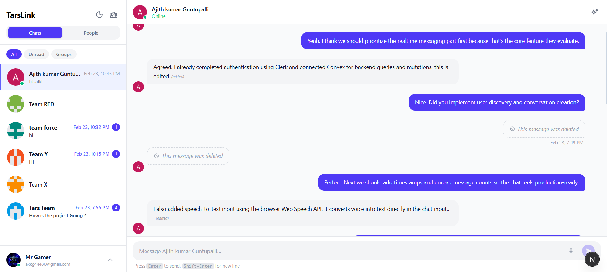
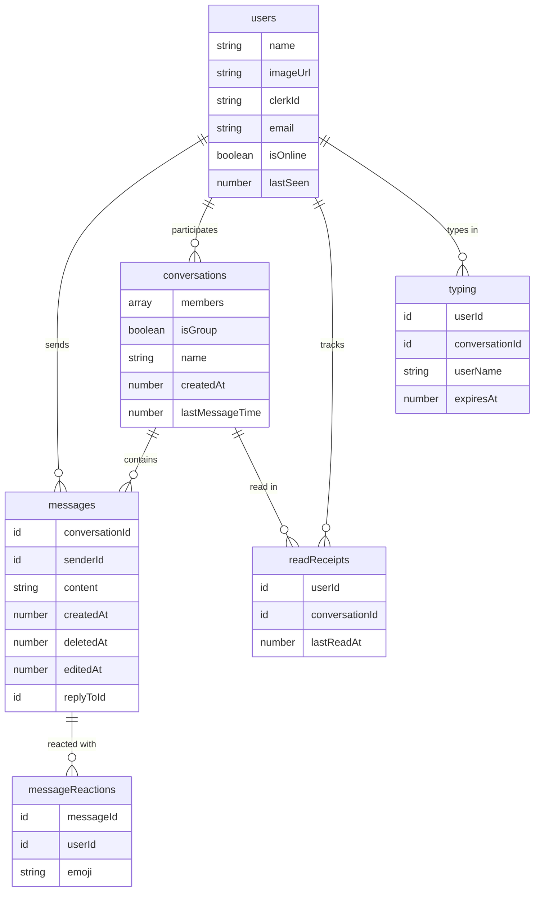

# TarsLink 🔗



> **TarsLink is a modern, real-time chat application built with Next.js 16 and Convex - featuring AI-powered conversation summaries, voice-to-text messaging, emoji reactions, typing indicators, and a premium dark/light UI.**

[](https://nextjs.org/)
[](https://convex.dev/)
[](https://clerk.com/)
[](https://ai.google.dev/)
[](https://www.typescriptlang.org/)
[](https://tailwindcss.com/)

---

## 🎥 Demo Video

Watch TarsLink in action - real-time messaging, AI summaries, voice input, and more:

▶️ **[Watch the Demo on Loom](https://www.loom.com/share/752d79dc752c48ce93ea25bb45bf51bf)**

---

## 🎯 The Problem

Most messaging apps are either bloated with unnecessary features or too basic to be useful. Teams and individuals need a clean, fast, and intelligent chat platform that:
- Works **instantly** without page refreshes or polling
- Helps users **catch up** on long conversations quickly
- Supports **natural input** methods beyond just typing
- Looks and feels **premium** without the complexity

---

## ✨ The Solution: TarsLink

TarsLink is a full-featured, real-time messaging platform that combines the speed of Convex's reactive backend with the intelligence of Google Gemini AI. Every message, reaction, and keystroke updates instantly across all connected clients  no refresh needed.

---

## 🌟 Key Features

### 💬 Real-Time Messaging
Instant message delivery powered by **Convex reactive queries**  no WebSockets to manage, no polling intervals. Messages appear the moment they're sent, with zero configuration.

### 🤖 AI-Powered Chat Summaries
Missed a long conversation? Click **"Summarize"** and **Gemini 2.5 Flash** analyzes the last 30 days of messages, generating a concise, readable summary in seconds.

### 🎤 Voice-to-Text Input
Speak your messages using the built-in **Web Speech Recognition API**. A real-time audio waveform visualizer provides feedback while you speak, and the transcript appears as you talk.

### 👥 1-on-1 & Group Conversations
Start private chats or create **named group conversations** with multiple participants. The sidebar shows all conversations sorted by most recent activity.

### 😄 Emoji Reactions
React to any message with emojis. Reactions are displayed below messages with counts, and you can toggle your own reactions on and off.

### ✏️ Edit & Delete Messages
Made a typo? **Edit** your messages in-line. Want to retract something? **Soft-delete** messages - they remain in the database but display as *"This message was deleted"*.

### ↩️ Reply to Messages
Reply to specific messages with a quoted preview, maintaining conversation context even in busy group chats.

### ⌨️ Typing Indicators
See who's typing in real-time with **ephemeral typing state** that auto-expires after 2 seconds, keeping the database clean.

### 🟢 Online Presence
User online/offline status with a **heartbeat system** - presence updates are tracked via `lastSeen` timestamps, showing accurate online indicators and "last seen" times.

### 🔢 Unread Message Counts
**Read receipts** track the last time each user viewed a conversation, displaying unread message badges in the sidebar.

### 🌗 Dark / Light Theme
A smooth theme toggle with **system preference detection** and **localStorage persistence**  powered by a custom `ThemeProvider` with CSS transitions.

### 📱 Auto-Scrolling
Smart auto-scroll that follows new messages but pauses when you scroll up to read history, with a "scroll to bottom" indicator.

---

## 🛠️ Tech Stack

| Category | Technology |
| :--- | :--- |
| **Framework** | Next.js 16 (App Router, Server Components) |
| **Language** | TypeScript 5 |
| **Backend** | Convex (Real-time reactive database) |
| **Authentication** | Clerk (OAuth, email/password) |
| **AI** | Google Gemini 2.5 Flash |
| **Styling** | Tailwind CSS 4, PostCSS |
| **Voice Input** | Web Speech Recognition API + AudioContext |
| **Deployment** | Vercel + Convex Cloud |

---

## 📁 Folder Structure

```
tarslink/
├── convex/                          # Convex backend (serverless functions + schema)
│   ├── _generated/                  # Auto-generated Convex types & API
│   ├── schema.ts                    # Database schema (users, conversations, messages, etc.)
│   ├── auth.config.ts               # Clerk ↔ Convex auth integration
│   ├── conversations.ts             # Get, create, and manage conversations
│   ├── messages.ts                  # Send, edit, delete, and query messages
│   ├── reactions.ts                 # Add/remove emoji reactions
│   ├── readReceipts.ts              # Track read status & unread counts
│   ├── typing.ts                    # Ephemeral typing indicator state
│   └── users.ts                     # User CRUD, presence, and online status
│
├── src/
│   ├── app/
│   │   ├── (auth)/                  # Auth route group
│   │   │   ├── sign-in/[[...sign-in]]/page.tsx   # Clerk sign-in page
│   │   │   ├── sign-up/[[...sign-up]]/page.tsx   # Clerk sign-up page
│   │   │   └── layout.tsx           # Centered auth layout
│   │   ├── (dashboard)/             # Protected dashboard route group
│   │   │   ├── chat/
│   │   │   │   └── page.tsx         # Main chat page
│   │   │   └── layout.tsx           # Dashboard layout with providers
│   │   ├── api/
│   │   │   └── summarize/route.ts   # AI summarization API (Gemini 2.5 Flash)
│   │   ├── globals.css              # Global styles & theme variables
│   │   ├── layout.tsx               # Root layout with Clerk + Convex providers
│   │   └── page.tsx                 # Root redirect (→ /chat or → /sign-in)
│   │
│   ├── components/
│   │   ├── chat/
│   │   │   ├── Sidebar.tsx          # Conversation list, search, user list, group creation
│   │   │   ├── ChatWindow.tsx       # Message thread, header, typing indicators
│   │   │   ├── ChatInput.tsx        # Message input with voice, reply, emoji support
│   │   │   ├── MessageBubble.tsx    # Individual message with reactions, edit, delete, reply
│   │   │   ├── ChatSummaryDialog.tsx # AI summary modal (Gemini integration)
│   │   │   ├── CreateGroupDialog.tsx # Group conversation creation dialog
│   │   │   └── UserList.tsx         # Online users list with presence indicators
│   │   ├── layout/                  # Shared layout components
│   │   └── shared/                  # Reusable UI primitives
│   │
│   ├── hooks/
│   │   ├── useAutoScroll.ts         # Smart auto-scroll with manual override
│   │   ├── useConversation.ts       # Conversation state hook
│   │   ├── useCurrentUser.ts        # Current authenticated user hook
│   │   ├── useIsOnline.ts           # Online/offline detection
│   │   ├── usePresenceHeartbeat.ts  # Periodic presence ping to Convex
│   │   ├── useSpeechRecognition.ts  # Voice input with waveform visualization
│   │   └── useTypingIndicator.ts    # Typing state management
│   │
│   ├── lib/
│   │   ├── constants.ts             # App-wide constants
│   │   ├── formatTime.ts            # Time formatting utilities
│   │   ├── formatTimestamp.ts        # Timestamp display helpers
│   │   ├── utils.ts                 # General utilities (cn, etc.)
│   │   └── validators.ts            # Input validation helpers
│   │
│   ├── providers/
│   │   ├── ClerkProvider.tsx         # Clerk auth wrapper
│   │   ├── ConvexProvider.tsx        # Convex client + Clerk token sync
│   │   └── ThemeProvider.tsx         # Dark/light theme with localStorage persistence
│   │
│   ├── types/
│   │   ├── conversation.ts          # Conversation type definitions
│   │   ├── convex.ts                # Convex-specific types
│   │   ├── message.ts               # Message type definitions
│   │   └── user.ts                  # User type definitions
│   │
│   └── middleware.ts                # Clerk route protection (/chat requires auth)
│
├── public/                          # Static assets (SVGs, icons)
├── vercel.json                      # Vercel deployment config (Convex build integration)
├── next.config.ts                   # Next.js configuration
├── tailwind.config.ts               # Tailwind CSS configuration
├── tsconfig.json                    # TypeScript configuration
├── package.json                     # Dependencies and scripts
├── .env.local                       # Local dev environment variables (gitignored)
├── .env.production                  # Production environment variables (gitignored)
├── .env.example                     # Environment variable template
└── README.md                        # This file
```

---

## ⚙️ Setup and Installation

### Prerequisites

- **Node.js** 18+
- **npm** 9+
- A **Clerk** account → [dashboard.clerk.com](https://dashboard.clerk.com)
- A **Convex** account → [dashboard.convex.dev](https://dashboard.convex.dev)
- A **Google AI** API key → [aistudio.google.com](https://aistudio.google.com/app/apikey)

### 1. Clone the Repository

```bash
git clone https://github.com/ajith-kumar99/TarsLink.git
cd TarsLink/tarslink
```

### 2. Install Dependencies

```bash
npm install
```

### 3. Configure Environment Variables

Copy the example file and fill in your keys:

```bash
cp .env.example .env.local
```

```env
# Convex
CONVEX_DEPLOYMENT=dev:your-deployment-name
NEXT_PUBLIC_CONVEX_URL=https://your-deployment.convex.cloud
NEXT_PUBLIC_CONVEX_SITE_URL=https://your-deployment.convex.site

# Clerk
NEXT_PUBLIC_CLERK_PUBLISHABLE_KEY=pk_test_...
CLERK_SECRET_KEY=sk_test_...

# Google Gemini
GEMINI_API_KEY=your-gemini-api-key

# Clerk Redirects
NEXT_PUBLIC_CLERK_SIGN_IN_URL=/sign-in
NEXT_PUBLIC_CLERK_SIGN_UP_URL=/sign-up
NEXT_PUBLIC_CLERK_AFTER_SIGN_IN_URL=/chat
NEXT_PUBLIC_CLERK_AFTER_SIGN_UP_URL=/chat
```

### 4. Start Convex Dev Server

```bash
npx convex dev
```

This initializes the Convex backend, creates tables, and syncs the schema.

### 5. Start the App

In a separate terminal:

```bash
npm run dev
```

Open [http://localhost:3000](http://localhost:3000) in your browser.

---

## 🚀 Deployment (Vercel)

TarsLink is configured for one-click Vercel deployment with automatic Convex function syncing.

### Steps

1. Push your code to GitHub
2. Import the repo on [vercel.com/new](https://vercel.com/new) - set **Root Directory** to `tarslink`
3. Add these environment variables in Vercel:

| Variable | Value |
| :--- | :--- |
| `CONVEX_DEPLOY_KEY` | From Convex Dashboard → Settings → Deploy Key |
| `NEXT_PUBLIC_CONVEX_URL` | Your production Convex URL |
| `NEXT_PUBLIC_CONVEX_SITE_URL` | Your production Convex site URL |
| `NEXT_PUBLIC_CLERK_PUBLISHABLE_KEY` | From Clerk Dashboard |
| `CLERK_SECRET_KEY` | From Clerk Dashboard |
| `GEMINI_API_KEY` | From Google AI Studio |
| `NEXT_PUBLIC_CLERK_SIGN_IN_URL` | `/sign-in` |
| `NEXT_PUBLIC_CLERK_SIGN_UP_URL` | `/sign-up` |
| `NEXT_PUBLIC_CLERK_AFTER_SIGN_IN_URL` | `/chat` |
| `NEXT_PUBLIC_CLERK_AFTER_SIGN_UP_URL` | `/chat` |

4. Deploy! The `vercel.json` build command automatically deploys Convex functions before building Next.js.

---

## 🗄️ Database Schema



